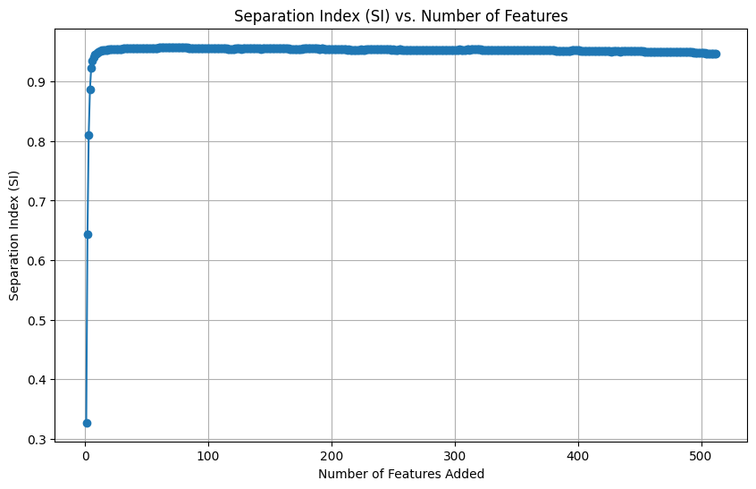
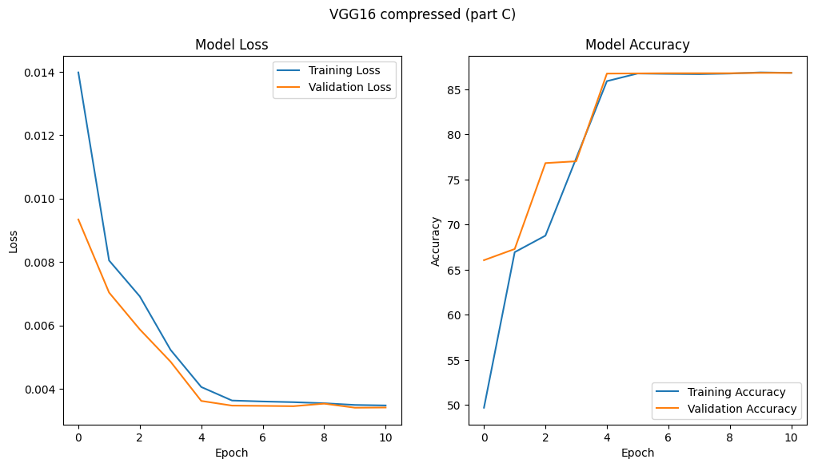

<!DOCTYPE html>
<html lang="en">
<head>
    <meta charset="UTF-8">
    <meta name="viewport" content="width=device-width, initial-scale=1.0">
    
Network Optimization Results 

</head>
<body>
    <ul>
         
        
        
        
        
</body>
</html>
